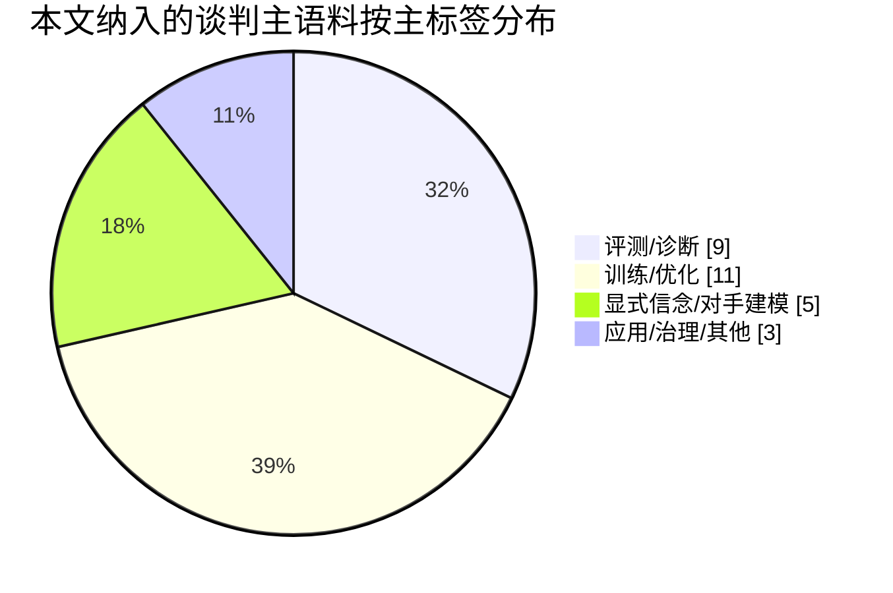
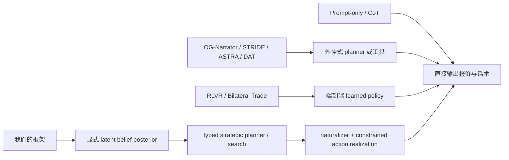

# Negotiation as Planning under Latent Beliefs 文献综述与定位建议

## 执行摘要

- 过去两年的 LLM 谈判研究已经非常明确地表明：**高 deal rate 远不等于高 utility**。从 Buyer-Seller 场景、Ultimatum/Trading/Resource Exchange，到更复杂的多方竞争与市场仿真，当前强模型经常“会成交但不赚钱”，并且容易出现预算泄露、过度让步、情绪性被操纵、语言—动作不一致等问题。citeturn0academia3turn0academia1turn7academia1turn40academia5turn41academia3

- 现有方法大致分成四条路线：**纯 prompting/CoT**、**外接式模块化策略器**、**端到端 RL/RLVR**、以及**显式 opponent modeling / belief tracking**。其中，prompting 和 RLVR 都能显著提升某些指标，但前者普遍缺少稳定策略纪律，后者又往往把“belief 推断—planning—surface realization”纠缠在同一个 policy 里，导致可解释性、可审计性和可迁移性不足。citeturn5academia3turn6academia0turn36academia0turn36academia1turn40academia0turn41academia0

- 与你提出的 **Negotiation as Planning under Latent Beliefs** 最接近的已有工作，并不是 prompt 竞赛类论文，而是 **ASTRA、BOND、Preference Estimation、以及部分 ToM / inverse-planning 文献**。这些工作说明“belief 显式化”已经是一个真实存在且正在升温的方向；因此你们的 novelty 不能只写成“我们也建 belief model”，而应明确写成：**把显式 latent belief、精确 typed planner / search、和受约束的 naturalizer 联成一个 negotiation-specific, end-to-end-evaluable framework**。citeturn6academia0turn40academia0turn41academia0turn47academia2turn45academia0turn45academia2

- 如果面向 NeurIPS/ICML，最稳妥的 claim 不是“我们首次解决了 negotiation”，而是：**在部分可观测、长程、多轮、对手私有信息存在的谈判中，显式信念状态 + belief-conditioned planning 比纯 prompting、纯外接 offer generator、以及纯 end-to-end RLVR 更能稳定提升 utility、belief calibration、鲁棒性与 action-language consistency**。这一定位既能接住谈判文献，也能接住 Cicero、DAT、RAP、ToM、inverse planning、BDI 等更广的 agent/planning 脉络。citeturn55news1turn6academia2turn22academia0turn46academia0turn45academia1turn42academia2

- 你上传的 PPT 已经非常接近这个定位：它把问题拆成 **belief model、typed strategic policy、naturalizer**，并且指出了 prompting 在 **quality-success、repair inflation、seller character robustness、language-action mismatch** 上的系统性短板。真正需要补齐的，是把这些诊断转成**论文级别的因果主张与 evaluation protocol**。fileciteturn0file2

## 范围与分类标准

本综述优先覆盖四类文献：一是 **LLM negotiation 直接相关论文**；二是这些论文向前可追溯的关键谈判系统与 opponent-modeling 论文；三是用户点名的 **Cicero、DipLLM、Strategic Reasoning with Language Models、Theory of Mind、inverse planning、BDI、generative agents** 等邻近技术线；四是 2025–2026 新近出现、与“latent belief + planning”特别相关的新增论文，例如 **BOND、Preference Estimation、PrefBench、EmoDistill、PRISMA** 等。对于只在用户题录中出现、但当前检索界面未能稳定定位公开页面的论文，我会明确标成 **unspecified**，而不是硬性补全。citeturn6academia3turn36academia0turn36academia1turn40academia0turn41academia0turn40academia5turn25academia3turn25academia0

文中 “**drop-in**” 采用的是一种工程化判据：如果一个方法可以在**冻结或几乎冻结的基础 LLM**之上，以 inference-time scaffold、小 planner、小工具层、小 adapter 等方式接入，而不必重训整个谈判 policy，我就将它视为 **drop-in = 是**。因此，OG-Narrator、ASTRA、STRIDE、DAT、ReAct 这类方法通常会被判成 “是”；而 RLVR、SFT+GRPO、ToMnet、BOND-student 这类需要重新训练谈判模型本体的方法会被判成 “否” 或“部分”。这个判据是为了服务你们的 paper positioning，而不是复述原论文自带术语。 fileciteturn0file2

从你上传的 PPT 来看，你们当前最自然的“对照轴”不是单纯的 prompt vs RL，而是四类系统的结构差异：**prompt-only**、**drop-in strategic wrapper**、**end-to-end RL policy**、以及**belief-conditioned planner**。PPT 里已经把 seller type / reservation / patience 视作自然的 belief target，并且把 anchor / hold / concede / accept 式的 typed strategic action 作为后续 RL 目标，这是非常好的切入点。fileciteturn0file2

## 关键比较总表

下表只放**和你们最有可比性**的代表作；后文再给较完整目录与逐类总结。

| 论文 | 年份 | task / benchmark | belief explicitness | planner type | drop-in? | evaluation metrics | main limitation |
|---|---:|---|---|---|---|---|---|
| **Deal or No Deal? End-to-End Learning for Negotiation Dialogues**，Lewis et al. citeturn28academia0 | 2017 | multi-issue bargaining | 隐式 | dialogue rollouts | 否 | task reward、agreement、human eval | 策略与语言耦合，RL 易退化；没有显式 opponent belief |
| **Decoupling Strategy and Generation in Negotiation Dialogues**，He et al. citeturn28academia3 | 2018 | DealOrNoDeal、CraigslistBargain | 弱显式 | coarse dialogue acts | 是 | task success、price、human-likeness | 有 strategy/generation 解耦，但 belief 不显式 |
| **Measuring Bargaining Abilities of LLMs**，Xia et al. citeturn0academia3 | 2024 | AmazonHistoryPrice buyer-seller bargaining | 无到弱显式 | Offer Generator + Narrator | 是 | buyer/seller gains、deal rate、profit | 报价逻辑主要外包给 deterministic generator |
| **NegotiationArena**，Bianchi et al. citeturn0academia1 | 2024 | ultimatum、trading、price negotiation | 隐式 | prompt tactics | 否 | payoff、irrationality、tactic effects | 更像 benchmark/analysis，不是可审计 planner |
| **ASTRA**，Kwon et al. citeturn6academia0 | 2025 | dynamic human-like negotiation | 显式 opponent modeling | LP dynamic offer optimization | 是 | simulations + human eval | 很强，但还是原则驱动式 optimizer，不是 posterior-driven belief planner |
| **Advancing AI Negotiations**，Vaccaro et al. citeturn5academia3 | 2025 | 大规模 autonomous negotiation competition | 角色/风格显式 | prompt engineering | 是 | value created/claimed、subjective value、deal freq | 主体仍是 prompt 竞赛，不是 learned planner |
| **MERIT Feedback Elicits Better Bargaining**，Oh et al. citeturn6academia3 | 2026 | AgoraBench 九类复杂议价情境 | 弱显式 | utility-feedback prompting / finetuning | 部分 | agent utility、negotiation power、acquisition ratio | 人偏好/效用反馈强，但 belief/planner 仍未深度解耦 |
| **Instructing LLMs to Negotiate using RLVR**，Liu et al. citeturn36academia0 | 2026 | AmazonHistoryPrice bilateral price negotiation | 隐式 | end-to-end RLVR / GRPO | 否 | reward、deal rate、bargained ratio、overshoot | 证明 RLVR 很强，但 belief 与策略全部内化，难审计 |
| **Training Language Models for Bilateral Trade with Private Information**，Bergemann et al. citeturn36academia1 | 2026 | structured bilateral trade simulator | 隐式 | tool-called structured bargaining + SFT/GRPO | 否 | surplus share、deal rate、round-robin outcomes | 结构化 action 很清晰，但仍缺显式 latent belief state |
| **BOND**，Cui & Lin citeturn40academia0 | 2026 | CaSiNo negotiation | 显式 Bayesian posterior | menu-based decision making | 否 | Brier score、belief calibration、policy error decomposition | belief 很强，planning/search 偏弱 |
| **Preference Estimation via Opponent Modeling in Multi-Agent Negotiation**，Konishi et al. citeturn41academia0 | 2026 | multi-party multi-issue negotiation | 显式 Bayesian preference estimation | probabilistic opponent modeling | 部分 | full agreement rate、preference estimation accuracy | 强在估计，不强在精确 long-horizon planning |
| **PrefBench**，Lei citeturn40academia5 | 2026 | hidden-preference personalized pricing negotiation | 显式隐藏偏好 benchmark | zero-shot JSON action protocol | 否 | profit、deal rate、7,500 episodes | benchmark，不提供训练框架 |
| **Cicero**，Bakhtin et al.；可由后续评估与官方报道侧证 citeturn54academia3turn55news1turn55academia2 | 2022 | full-press Diplomacy | 显式/隐式混合：belief + intent inference | strategic reasoning + dialogue | 否 | league score、percentile、message analysis | 是最强“信念+规划+语言”先例，但不是 price negotiation |
| **Strategic Reasoning with Language Models**，Gandhi et al. citeturn15academia1 | 2023 | matrix games + realistic negotiation scenarios | 显式 reasoning demos over states/values/beliefs | few-shot CoT strategic reasoning | 是 | generalization to new games/objectives | 强在 prompting-generic reasoning，弱在真实议价环境与 calibration |
| **Dialogue Action Tokens**，Li et al. citeturn6academia2 | 2024 | Sotopia、multi-turn red-teaming | 无 | small continuous planner steering frozen LM | 是 | social sim metrics、attack success | planner 很值得借鉴，但不含对手 private info |
| **SimpleToM**，Gu et al. citeturn47academia2 | 2024 | downstream ToM reasoning stories | 显式 mental-state QA | reminder / ToM-specific intervention | 是 | mental-state / behavior / judgment accuracy | 直接说明“知道对手 belief ≠ 会把 belief 用进 action” |
| **我们的框架 Negotiation as Planning under Latent Beliefs**，基于你上传的 PPT 设想 fileciteturn0file2 | 进行中 | 应至少覆盖 AgenticPay + 一个多议题基准 + 一个 price benchmark | **显式 latent belief posterior** | **belief-conditioned typed planner / search** | **可做成是** | **utility、belief calibration、strategy validity、action-language consistency、robustness** | 关键风险是与 ASTRA/BOND 的 novelty 边界需要写得更尖锐 |

这张表最重要的结论是：**你们最不该把自己和“prompt-only baseline”比，而最该把自己和 ASTRA、BOND、Bilateral Trade、RLVR、DAT、Cicero 这六条线对齐后再区分**。因为真正的审稿人会问的不是“你是否比 CoT 更好”，而是“你相对于最接近的 **belief / planning / modularization** 方案到底新在哪里”。citeturn6academia0turn40academia0turn36academia1turn36academia0turn6academia2turn54academia3turn55news1

## 谈判文献目录

下表覆盖**直接与 LLM negotiation 相关**的核心论文；我把每篇都压缩成“方法—数据/bench—指标—覆盖组件—相对你们的区别”五个维度。若某项在公开摘要中没有写清楚，我标为 **unspecified**。

| 论文 | 方法、bench、指标 | 覆盖组件 | 与你们框架的区别 |
|---|---|---|---|
| **Deal or No Deal? End-to-End Learning for Negotiation Dialogues**，Lewis et al., 2017 citeturn28academia0 | 人类多议题谈判数据；端到端训练 + dialogue rollouts；看 agreement、task reward、human eval | planner/search、RL | 先驱，但没有显式 belief，也没有把语言 realize 与 strategy 解耦 |
| **Decoupling Strategy and Generation in Negotiation Dialogues**，He et al., 2018 citeturn28academia3 | DealOrNoDeal 与 CraigslistBargain；coarse dialogue acts + retrieval generation；看 task success、price、human-likeness | planner、naturalizer、drop-in | 和你们一样强调“策略/语言解耦”，但没有 belief posterior，也没有 numeric search over latent private values |
| **Show, Price and Negotiate**，Parvaneh et al., 2019 citeturn28academia1 | CraigslistBargain + 图像；online value look-ahead、action predictor、language generator；看 agreement price、一致性、对话质量 | planner、naturalizer | 更像 value look-ahead 的老式模块系统；不是 latent belief planning |
| **Multi-Issue Bargaining With Deep RL**，Chang, 2020 citeturn27academia1 | 多议题数值 bargaining；actor-critic 学 bidding / acceptance；看 surplus、fairness、adaptation | planner、RL、opponent modeling | 对你们的价值在于“planner 可精确化”，但它没有自然语言，也不是 LLM |
| **Improving Dialog Systems for Negotiation with Personality Modeling**，Yang et al., 2020 citeturn43academia1 | CraigslistBargain；ToM 式人格潜变量推断 + 高层策略自适应；看 agreement rate、行为多样性 | belief model、opponent modeling | 这是你们非常重要的“祖先文献”：说明显式对手建模在谈判里不是新概念，但它并没有把 belief 接到精确 price planner 上 |
| **Improving Language Model Negotiation with Self-Play and In-Context Learning from AI Feedback**，Fu et al., 2023 citeturn0academia0 | buyer/seller + critic 三模型自博弈；多轮 ICL 与 AI feedback；看成交价与破局风险 | RL/self-play、opponent modeling | 强在 self-play 学策略，但 policy 仍是 prompt-level 的，不是可审计 belief-conditioned planner |
| **Cooperation, Competition, and Maliciousness: LLM-Stakeholders Interactive Negotiation**，Abdelnabi et al., 2023 citeturn23academia1 | 多方、多议题、语义丰富的 negotiation benchmark；看 performance、role alignment、安全性 | benchmark、opponent modeling | 强 benchmark；对你们很适合作为外部评测，不是直接比较的方法模型 |
| **Assistive LLM Agents for Socially-Aware Negotiation Dialogues**，Hua et al., 2024 citeturn23academia0 | 两个 LLM role-play + 第三个 remediator 改写不合规范话语；看 outcome 与社交规范 | naturalizer、drop-in | 最接近你们的 “naturalizer” 线，但它是辅助改写，不负责 utility-max planning |
| **Evaluating Language Model Agency through Negotiations**，Davidson et al., 2024 citeturn0academia2 | self-play / cross-play 的 negotiation games；评估 agency 与 alignment | benchmark | 说明 negotiation 是好的 agent benchmark，但不提供 belief/planner 设计 |
| **Measuring Bargaining Abilities of LLMs**，Xia et al., 2024 citeturn0academia3 | AmazonHistoryPrice；OG-Narrator 用 deterministic offer generator 控制报价，再让 LLM 写话术；看 gains、deal rate、profit | planner、naturalizer、drop-in | 和你们最该比较的点之一：它把“报价”做成外部模块，但没有 belief model，也没有 endogenous planning |
| **NegotiationArena**，Bianchi et al., 2024 citeturn0academia1 | ultimatum、trading、buy/sell 三类场景；研究 tactic 与 irrationality 对 payoff 的影响 | benchmark | 适合检验你们 planner 是否学到 tactics，但本身不是方法论文 |
| **Using Large Language Models for Humanitarian Frontline Negotiation**，Ma et al., 2024 citeturn1academia1 | 前线人道谈判辅助工具；用真实案例与专家访谈评估质量与稳定性 | applied planning support | 强在高风险应用与 planning support，不是 autonomous negotiator；可支持你们的动机段 |
| **STRIDE**，Li et al., 2024 citeturn27academia0 | 通用 strategic decision-making tool framework，含 bilateral bargaining；看各环境量化指标 | planner、tool use、drop-in | 很像“外接 planner/tool”范式；你们要强调自己不是 tool wrapper，而是 belief-conditioned negotiation architecture |
| **AgreeMate**，Chatterjee et al., 2024 citeturn2academia0 | modular bargaining architecture + coarse actions；比较 prompt、CoT、fine-tuning | planner、naturalizer | 支持“模块化比纯 prompting 更靠谱”，但没有信念追踪与可审计 belief state |
| **ASTRA**，Kwon et al., 2025 citeturn6academia0 | 三阶段：解释对手、LP 优化 counteroffer、估算 acceptance probability；simulation + human eval | belief model、planner、drop-in、opponent modeling | 这是你们最危险的近邻：你们必须明确自己比它**多了显式 latent belief posterior、可训练 typed planner、以及 naturalizer consistency** |
| **FishBargain**，Kong et al., 2025 citeturn6academia1 | 闲鱼卖家 bargaining agent；理解上下文与商品信息，选择 action 与 language skill；平台部署 | planner、naturalizer、applied | 工业化很强，但卖家导向、belief 不显式，公开评测细节较少 |
| **Advancing AI Negotiations**，Vaccaro et al., 2025 citeturn5academia3 | 12 万+ AI-AI 谈判；比较 warmth、dominance、CoT、prompt injection；看 created/claimed value、subjective value | benchmark、prompt engineering | 证明“准备、温暖、支配性、AI-specific tactics”重要，但还是 prompt competition |
| **HARBOR**，Jiang et al., 2025 citeturn7academia0 | 以拍卖为 testbed 研究 persona、profiling、ToM | belief model、opponent modeling | 不是一般意义的谈判，但可借其 persona profiling 做 seller character belief |
| **The Automated but Risky Game**，Zhu et al., 2025 citeturn7academia1 | agent-to-agent 市场谈判与交易；看 financial losses、behavioral anomalies | benchmark、risk analysis | 适合支持你们“不能只看成交率”的论点 |
| **EvoEmo**，Long et al., 2025 citeturn2academia1 | 把情绪策略建成 MDP，用 evolutionary RL 学动态 emotion policy；看 success、efficiency、buyer savings | naturalizer、RL、自适应策略 | 情绪是重要 action channel；但它并不构成完整 belief/planning framework |
| **Debt Collection Negotiations with LLMs**，Wang et al., 2025 citeturn37academia1 | 债务协商；13 个指标、4 个方面；加 planning 与 judging module，并用 DPO 优化 | planner、judge、domain-specific | 说明高 stakes 场景需要 planning/judging；但不是一般化 negotiation framework |
| **MERIT Feedback Elicits Better Bargaining in LLM Negotiators**，Oh et al., 2026 citeturn6academia3 | AgoraBench 9 类经济议价场景；人偏好/效用对齐；看 utility、power、acquisition ratio | RL/feedback、benchmark | 和你们最该对照的点是：它把“human-grounded utility feedback”做强了，但没有显式 belief-search pipeline |
| **Instructing LLMs to Negotiate using RLVR**，Liu et al., 2026 citeturn36academia0 | AmazonHistoryPrice；buyer 对 regulated seller 做 RLVR/GRPO；看 reward、deal rate、bargained ratio、overshoot，且分析四阶段策略演化 | RL、implicit planner | 当前最强 end-to-end buyer baseline 之一；但 belief 仍黑箱化 |
| **Training Language Models for Bilateral Trade with Private Information**，Bergemann et al., 2026 citeturn36academia1 | event-driven simulator + tool calls，把 binding offers 与语言分开；SFT + GRPO；round-robin 15,000 场 | planner、structured action、RL | 结构清楚、benchmark 很强；但 latent belief 没有显式状态化 |
| **BOND**，Cui & Lin, 2026 citeturn40academia0 | LLM Bayesian teacher 对 6 种 priority ordering 维持 posterior，再蒸馏到 8B student；CaSiNo；看 Brier、校准、trajectory auditability | **belief model**、auditability、opponent modeling | 这是你们“belief 可审计化”的最近邻；但它的 decision layer 仍是 menu-based，不是精确 planning/search |
| **Preference Estimation via Opponent Modeling**，Konishi et al., 2026 citeturn41academia0 | LLM 从语言提质性线索，转成 Bayesian preference estimation；多方多议题；看 full agreement rate、estimation accuracy | **belief model**、opponent modeling | 强在 preference inference；你们可以更进一步，把 posterior 用于 typed strategic planning |
| **PrefBench**，Lei, 2026 citeturn40academia5 | 隐藏偏好的 personalized pricing benchmark；固定 protocol、7,500 episodes；看 profit vs deal rate | benchmark、latent preference evaluation | 很适合检验你们 belief calibration 和 utility-sensitive planning |
| **The Language of Bargaining**，Sinha et al., 2026 citeturn41academia3 | 英语与四种 Indic 语言的 negotiation；看 surplus 和 stability 的语言效应 | benchmark、cross-lingual behavior | 支持你们把 multilingual robustness 纳入 supplementary evaluation |
| **PRISMA**，Kajare et al., 2026 citeturn25academia0 | ENS-CoT + self-training + DPO；JobNego/ResNego；自动与人工评测 interpretability 和 negotiation effectiveness | naturalizer、emotion、training | 强在情绪可解释性；你们可以吸收其 emotion reasoning 作为 naturalizer 条件 |
| **EmoDistill**，Long et al., 2026 citeturn25academia3 | IQL 选情绪 + LoRA policy 表达情绪；跨域 transfer 与 tournament | naturalizer、RL、emotion skill | 进一步说明情绪是行动通道，但还不是完整 opponent-belief model |
| **Cattle Trade**，Müller & Müller, 2026 citeturn48academia0 | 长程多智能体经济游戏，含 bluffing、bidding、bargaining；看 spending efficiency 与行为 trace | benchmark | 不是纯双边谈判，但可作为 long-horizon robustness stress test |
| **Learning to Negotiate**，Anantaprayoon et al., 2026 citeturn40academia9 | negotiation-driven alignment；两 persona self-play + RLAIF/GRPO | RL/self-play | 更偏 alignment，不是 economic bargaining；但支持“negotiation as training signal”这一宏观叙事 |

需要单独说明的是：用户给出的 **Vahidov et al. (2025)**、**Genteel-Negotiator (AAAI 2025)**、以及 **Bhattacharya et al. (2025 HFES)** 三条题录，我在当前可用检索界面中**未找到稳定公开页面**；因此我不把它们作为支撑性证据来下强结论，只能暂记为 **unspecified**。如果你后续手头有 DOI、会议页或 PDF，我建议把它们补进附录表。

从这张目录可以看到，**直接把 negotiation 拆成 belief / planner / naturalizer 三段式的论文仍然很少**。现有大多数工作要么黑箱化地学一个政策，要么把 deterministic offer generator / LP solver / remediator 作为外挂，要么只在 benchmark 层面诊断问题。这个“结构空位”正是你们最有希望站住的地方。citeturn36academia0turn36academia1turn6academia0turn40academia0turn41academia0turn6academia2

## 多智能体规划与对手建模的可借鉴文献

与 “Negotiation as Planning under Latent Beliefs” 最相关的邻近线，不是一般 agent survey，而是**能把隐藏心智变量、规划、语言 realization 三者联起来**的工作。

| 论文 | 核心内容 | 对你们最有价值的借鉴 |
|---|---|---|
| **Human-Level Performance in No-Press Diplomacy via Equilibrium Search**，Gray et al., 2020 citeturn18academia2 | 以 equilibrium search 解决无对话 Diplomacy | 证明“复杂战略游戏里，显式 search 比纯 policy 更关键” |
| **No-Press Diplomacy from Scratch**，Bakhtin et al., 2021 citeturn18academia3 | 从零训练大分支策略搜索 | 证明自博弈会学到与人类不同的 equilibrium；提示你们需要 cross-play eval |
| **Mastering the Game of No-Press Diplomacy via Human-Regularized RL and Planning**，Bakhtin et al., 2022 citeturn54academia1 | 用 human-regularized RL + planning 学人类兼容策略 | 可借其“human-model regularization”思路，把 planner 约束在人类可接受谈判轨迹上 |
| **Cicero**，Bakhtin et al., 2022；后续分析与公开报道可见 citeturn54academia3turn55news1turn55academia2 | 最核心启发是：把**战略决策**与**自然语言对话**放在同一系统中，并通过对他人 beliefs/intentions 的推断来协同二者 | 这几乎就是你们宏观叙事的最强先例，因此要强调你们把这条路线“收缩到双边谈判 + 精确出价 + 可审计 latent belief” |
| **DipLLM**，Xu et al., 2025 citeturn15academia0 | 用 autoregressive factorization 学 Diplomacy equilibrium policy | 说明强 planner 不一定非要 MCTS；也可以把复杂行动分解成可监督/可 RL 的子决策 |
| **Strategic Reasoning with Language Models**，Gandhi et al., 2023 citeturn15academia1 | 用系统生成的 states-values-beliefs few-shot demos，让 LLM 泛化到新博弈 | 支持你们把 belief/state/value triple 明确写进 planner 接口 |
| **Dialogue Action Tokens**，Li et al., 2024 citeturn6academia2 | 训练一个小 planner，用连续 action vector steer 冻结 LM，多轮对话中保持语言质量 | 对你们的 “drop-in typed planner” 极有借鉴价值：planner 可以小，LM 可以冻结 |
| **ReAct**，Yao et al., 2022 citeturn19academia0 | reasoning 与 acting 交替 | 适合做 planner—naturalizer 的最弱 baseline，但不够谈判专用 |
| **RAP**，Hao et al., 2023 citeturn22academia0 | 把 LM 同时当 world model 和 reasoning agent，并用 MCTS 搜索 | 给你们的核心贡献一个现成话术：**negotiation is planning under a social world model**；不同点在于你们的“world model”不是物理状态，而是对手 latent belief/utility/acceptance model |
| **DEPS**，Wang et al., 2023 citeturn22academia2 | Describe / Explain / Plan / Select 的 interactive planning | 可借来构造 planner 内部的 plan refinement loop |
| **Reflexion**，Shinn et al., 2023 citeturn20academia0 | 语言式 verbal RL + episodic memory | 适合作为自博弈/在线 adaptation baseline，但仍不显式维护 opponent posterior |
| **Generative Agents**，Park et al., 2023 citeturn15academia2 | 记忆、反思、日程规划形成 believable social behavior | 对你们最有用的是“memory 和 reflection 应该服务于 belief update，而不是泛泛 social simulation” |
| **Machine Theory of Mind**，Rabinowitz et al., 2018 citeturn46academia0 | ToMnet 从行为观测中恢复他人 latent state | 给你们 belief head 的建模先例：从 trajectory infer opponent latent variables |
| **Large Language Models Fail on Trivial Alterations to Theory-of-Mind Tasks**，Ullman, 2023 citeturn47academia1 | 纯 prompt ToM 很脆弱 | 直接支撑“prompted belief reasoning 不足以做稳定 negotiation control” |
| **SimpleToM**，Gu et al., 2024 citeturn47academia2 | mental-state inference 对了，但 behavior / judgment 仍会错 | 这是你们论文最该引用的 ToM 证据之一：**belief estimation 与 belief-conditioned action 是两回事** |
| **AutoToM**，Zhang et al., 2025 citeturn46academia3 | automated Bayesian inverse planning 做开放域 ToM | 可借其“贝叶斯反推 + 自动 refinement”的思想来更新 seller type / patience / walkaway posterior |
| **Theory of Minds: Understanding Behavior in Groups Through Inverse Planning**，Shum et al., 2019 citeturn45academia0 | 用 inverse planning 从群体行为恢复 latent relationships | 说明 latent social structure 也能做成 posterior；你们可以把 bilateral negotiation 的 latent structure 简化成 reservation / patience / warmth / dominance |
| **Inferring the Goals of Communicating Agents from Actions and Instructions**，Ying et al., 2023 citeturn45academia1 | 把自然语言 instruction 也纳入 Bayesian inverse planning | 非常适合支撑你们“语言不仅是表层 realization，也是 belief update 的观测” |
| **Online Bayesian Goal Inference for Boundedly-Rational Planning Agents**，Tan et al., 2020 citeturn45academia2 | 在线 Bayesian goal inference，允许次优行为和回退 | 与真实谈判高度契合：卖家/买家都不是全理性体，belief update 必须容纳 bounded rationality |
| **SPIN**，Chen et al., 2024 citeturn42academia3 | 自博弈提升弱模型 | 可作为训练范式参考，不足以替代 negotiation-specific reward/structure |
| **SPIRAL**，Liu et al., 2025 citeturn42academia2 | 零和多轮自博弈 RL，包含 simple negotiation 子任务 | 说明 self-play game curriculum 能迁移 reasoning，但谈判仍需专用 state/action design |
| **SAGE**，Peng et al., 2026 citeturn42academia1 | Challenger-Planner-Solver-Critic 的闭环自演化 | 很适合启发你们的 data generation / critic / planner 联训，但不是谈判专用 |

这些邻近文献支持一个清晰判断：**你们真正要 claim 的不是“谈判需要 reasoning”——这已是常识；而是“谈判需要一种社会型 world model，其中 latent belief 的显式更新，与 price/action planning 的精确化，是能够被验证地提升 utility 与 robustness 的”。** 这比单纯说 “our framework includes a belief model and planner” 强得多，也更贴合 Cicero、AutoToM、RAP、DAT 这类强参照物。citeturn55news1turn46academia3turn22academia0turn6academia2turn47academia2turn45academia2

## 我们的 novelty 与 claim 边界

如果以你上传的 PPT 为基底，你们最值得强化的 novelty 不是“再造一个 framework”，而是把 framework 写成三条**可检验**的研究命题。第一条是 **belief 的显式化与审计化**：与 RLVR、Bilateral Trade 这类把策略全内化在 policy 中的方法不同，你们可以让模型在每一轮都维护一个对对手 **reservation / patience / warmth-dominance / acceptance likelihood / possible tactic regime** 的显式后验，从而使 belief calibration、belief drift、belief-policy error decomposition 都能成为指标，而不只是中间过程。BOND 已经证明 belief posterior + Brier score + trajectory auditability 是可做的，但其 decision layer 偏弱；你们可以在此基础上把 “belief head” 接到更强的 plan/search 上。citeturn36academia0turn36academia1turn40academia0turn41academia0

第二条是 **planner 的“精确策略化”**。你们 PPT 里已经强调了 anchor / hold / concede / accept 这类 typed strategic action，以及 seller character 作为鲁棒性来源，这比单纯让 LLM 自发写一段 CoT 更有研究价值。真正值得 claim 的点，是 planner 不只选择一个“话术风格”，而是选择一个带参数的策略原语，例如：`probe(low_price, evidence_request)`、`firm_anchor(price, finality_strength)`、`calibrated_concession(delta, rationale)`、`walkaway_if(p_accept<τ && utility<0)`。ASTRA 的 LP optimization、Xia 等人的 deterministic offer generator、以及 DAT 的小 planner 都说明这种结构化中层动作是可行的；你们的新意在于把它**条件化到显式 latent belief 上**，并且把 numeric price path 真正做成 search object，而不是只做 prompt token。citeturn6academia0turn0academia3turn6academia2

第三条是 **naturalizer 不是表面润色器，而是 action-language consistency controller**。你们 PPT 里已经指出 raw output、repair 后 action、reward 三者会不一致，说明很多 prompting 成绩可能被 repair pipeline “抬高”了。只要你们把 naturalizer 写成一个受 planner 约束的 realization layer，并以 strict no-repair validity、semantic fidelity、language-action mismatch rate、style controllability 作为指标，这条线就会和普通“更礼貌/更流利”的 dialogue generation 拉开距离。Assistive SADAS、PRISMA、EmoDistill、EvoEmo 都表明语言风格和情绪确实会影响谈判结果，但它们通常把风格当作目标本身；你们可以更进一步，把风格/情绪当作**planner 选择的受控工具变量**。fileciteturn0file2 citeturn23academia0turn25academia0turn25academia3turn2academia1

因此，最安全也最有力的 novelty 表述，不该写成：

> “We are the first to introduce a belief model for LLM negotiation.”

这在 2026 年已经站不住，因为 BOND、Preference Estimation、ASTRA、人格/ToM 线都碰到了相近问题。更好的写法是：

> “We introduce a negotiation-specific architecture that treats bargaining as planning under latent beliefs, where an explicit and auditable opponent-belief state is coupled to a belief-conditioned typed planner and a constrained naturalizer. Unlike prior work that relies on prompt tactics, external deterministic offer generators, or end-to-end RL policies with implicit beliefs, our method separates belief inference, strategic planning, and linguistic realization, enabling direct evaluation of calibration, action consistency, and utility under partial observability.”

这个 claim 的好处是，它既不会与 BOND/ASTRA 撞车，又能自然容纳你们想强调的“belief model + precise planner + not just a framework but a research program”的三重贡献。citeturn40academia0turn41academia0turn6academia0turn36academia0turn36academia1

## NeurIPS/ICML 定位建议

如果投 NeurIPS/ICML，我建议把论文定位成一篇**“agent architecture + evaluation”** 论文，而不是纯 benchmark 或纯 RL-paper。主标题附近应突出 **partial observability、latent beliefs、planning、auditable negotiation**；主贡献写成三点：其一，提出一个把对手 latent belief 显式化并可校准评估的谈判架构；其二，提出一个 belief-conditioned typed planner，使让步节奏、出价轨迹、退出条件和语言风格可以被精确控制；其三，建立一套谈判导向而非对话导向的评测协议，至少同时报告 utility / surplus share、deal quality、belief calibration、action-language consistency、strict no-repair validity、cross-play robustness、persona robustness，并在 price bargaining + multi-issue bargaining 两类环境中验证。claim 上要避免“first belief model”与“negotiation solved”这两种高风险措辞，而应强调 **“bridging opponent modeling and exact planning for negotiation-focused LLM agents”**。这一定位最能与 ASTRA、BOND、RLVR、Bilateral Trade、Cicero、DAT 六类最近邻工作形成清晰边界。citeturn6academia0turn40academia0turn36academia0turn36academia1turn55news1turn6academia2

## 开放问题与局限

这份综述已经覆盖了当前最关键的公开主线，但仍有几处需要你写论文时格外小心。首先，**与用户题录中少数未公开可检索论文的对比仍不完整**，尤其是 Vahidov et al. 2025、Genteel-Negotiator 以及 Bhattacharya et al. 2025；如果这些工作恰好也做了显式 opponent modeling 或情绪/礼貌控制，最好在最终 related work 定稿前补齐。其次，**你们最需要新增的实验不是更多 prompt baseline，而是更强的“最近邻结构化 baseline”**：ASTRA-style optimizer、BOND-style posterior reporting、DAT-style small planner steering、和 strict no-repair evaluation。再次，如果只在单一 buyer-seller 数值议价环境上做实验，审稿人很可能会认为你们只是“为一个 benchmark 定制了一个更复杂的 scaffold”；因此至少要有一个 **multi-issue** 或 **cross-domain** 验证，来证明 latent-belief planner 的收益不是环境特例。最后，PPT 里已经暴露一个非常重要的问题：**repair 会显著夸大 prompting 表现**，所以最终论文里一定要把 “raw model → parser/repair → executable action” 分开报，并把 mismatch 本身升格为一级指标。fileciteturn0file2